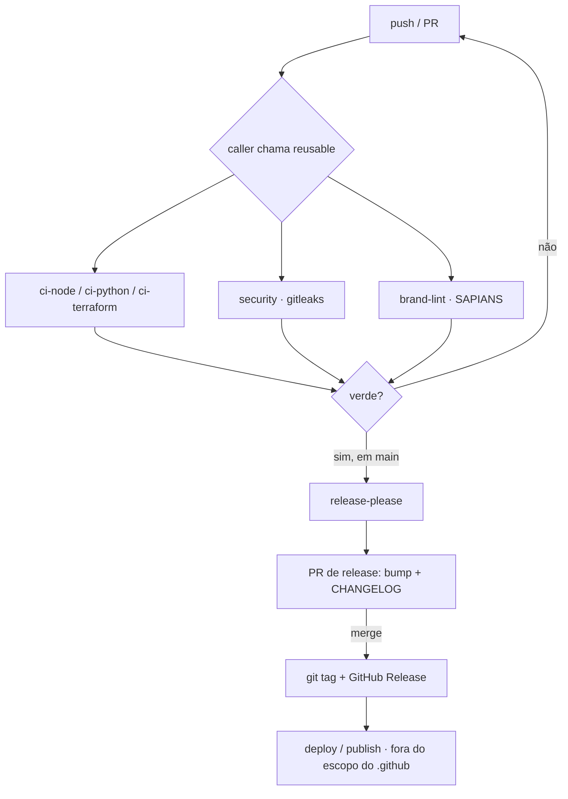

# .github — SAPIANS golden path

[](https://github.com/wbendinelli/.github/actions/workflows/lint.yml)
[](https://github.com/wbendinelli/.github/releases)
[](./LICENSE)

> **Tier:** `D` · **Classe:** `Config`

## O que é

Config **central de engenharia** dos repos `sapians-*`. Hospeda os **reusable workflows** (`workflow_call`) que cada repo chama em ~12 linhas, os **community health files** herdados, os **templates** e a ferramenta de **brand-lint**. Fonte única de CI/CD: um bump de versão de action aqui propaga a todos os repos.

- **Aqui = como USAR** o golden path (workflows, inputs, onboarding).
- **Por quê / o padrão** = handbook em [`sapians-platform/handbook/golden-path.md`](https://github.com/wbendinelli/sapians-platform/blob/main/handbook/golden-path.md).
- Manutenção dos workflows: [`docs/maintaining-workflows.md`](./docs/maintaining-workflows.md) · Troubleshooting: [`docs/troubleshooting.md`](./docs/troubleshooting.md).

## Como funciona (golden path)



## Como consumir

| Workflow | Para | Gates |
|---|---|---|
| [`ci-node.yml`](./.github/workflows/ci-node.yml) | Apps/Libs TS (pnpm + Biome) | lint · typecheck · build · test |
| [`ci-python.yml`](./.github/workflows/ci-python.yml) | Serviços Python pip ou uv (ruff + mypy + pytest) | ruff bloqueia · mypy/pytest ratchet |
| [`ci-python-uv.yml`](./.github/workflows/ci-python-uv.yml) | Serviços Python 100% uv (workspace/lockfile) | ruff check + ruff format + pytest, todos bloqueantes |
| [`ci-terraform.yml`](./.github/workflows/ci-terraform.yml) | IaC (Terraform) | validate bloqueia · fmt/tflint/checkov ratchet |
| [`security.yml`](./.github/workflows/security.yml) | Todos | gitleaks (binário, least-privilege) |
| [`brand-lint.yml`](./.github/workflows/brand-lint.yml) | Todos | "SAPIANS" caixa-alta em prosa (.md) |
| [`release-please.yml`](./.github/workflows/release-please.yml) | Todos | release automática (conventional commits) |

Política de gate: **bloqueiam sempre** lint/typecheck/build/test/validate/secret-scan. **Ratchet (report→block)** mypy/coverage/fmt/tflint/checkov — começam como report na adoção e apertam conforme o repo limpa. Ver [`docs/ratchet-pattern.md`](./docs/ratchet-pattern.md).

## Workflow Reference

### `ci-node.yml` — TS/Node (pnpm + Biome)
| Input | Tipo | Default | Propósito |
|---|---|---|---|
| `node-version` | string | `"22"` | Versão do Node (pinar no `.nvmrc`) |
| `pnpm-version` | string | `"9.15.9"` | Deve bater com `packageManager` do package.json |
| `working-directory` | string | `"."` | Root (monorepo: `.`) |
| `run-build` | bool | `true` | Rodar `pnpm build` (libs sem build: `false`) |
| `run-test` | bool | `true` | Rodar `pnpm test` (guard `hashFiles` pula se não há testes) |
| `registry-scope` | string | `"@sapians"` | Scope do GH Packages |

```yaml
jobs:
  ci:
    uses: wbendinelli/.github/.github/workflows/ci-node.yml@v0.4.1
    permissions: { contents: read, packages: read }
    with: { node-version: "22", pnpm-version: "9.15.9", run-build: true }
    secrets: inherit
```

### `ci-python.yml` — Python (ruff + mypy + pytest)
| Input | Tipo | Default | Propósito |
|---|---|---|---|
| `python-version` | string | `"3.12"` | Versão do Python |
| `use-uv` | bool | `false` | Usar `uv` (`uv sync` + `uv run`, lockfile `uv.lock`) em vez de pip |
| `install-target` | string | `".[dev]"` | Alvo do `pip install -e` (ignorado se `use-uv`) |
| `mypy-path` | string | `""` | Caminho do mypy (vazio = pula) |
| `mypy-blocking` | bool | `false` | mypy bloqueia? (ratchet) |
| `pytest-marker` | string | `"not integration"` | Marcador do pytest |
| `pytest-blocking` | bool | `false` | pytest bloqueia? (ratchet) |

`ruff` **sempre bloqueia**; mypy/pytest são report até `*-blocking: true`.

**pip (default) vs uv:** `use-uv: false` mantém o caminho pip byte-a-byte (sapians-api). `use-uv: true` troca para `astral-sh/setup-uv` + `uv sync` + `uv run …` e adiciona `ruff format --check` bloqueante. uv é o **padrão alvo da SAPIANS** (ver ADR no sapians-platform); pip segue suportado até a migração dos repos legados.

### `ci-python-uv.yml` — Python 100% uv (workspace/lockfile)
| Input | Tipo | Default | Propósito |
|---|---|---|---|
| `python-version` | string | `"3.12"` | Versão do Python |
| `run-lint` | bool | `true` | Rodar `ruff check` + `ruff format --check` |
| `run-tests` | bool | `true` | Rodar `pytest` |
| `working-directory` | string | `"."` | Root do projeto/workspace |
| `extra-install-args` | string | `""` | Args extras pro `uv sync` (ex: `--all-packages`) |

Sem ratchet — os gates nascem bloqueantes (repos uv da SAPIANS partem de CI limpo). Generalizado do CI do [`sapians-engram`](https://github.com/wbendinelli/sapians-engram). Diferença pro `ci-python.yml`: aqui uv é o **único** gerenciador (sem caminho pip); usar `ci-python.yml` (`use-uv: true`) quando precisar do ratchet mypy/pytest.

```yaml
jobs:
  ci:
    uses: wbendinelli/.github/.github/workflows/ci-python-uv.yml@v0.4.1
    permissions: { contents: read }
    with: { python-version: "3.12", extra-install-args: "--all-packages" }
```

### `ci-terraform.yml` — IaC
| Input | Tipo | Default | Propósito |
|---|---|---|---|
| `working-directory` | string | `"environments/prod"` | Root module |
| `terraform-version` | string | `"1.9.8"` | Versão do Terraform |
| `strict` | bool | `true` | fmt/tflint/checkov bloqueiam? (`false` = adoção/report) |
| `strict-fmt` | bool | `false` | só o fmt bloqueia (degrau do ratchet); tflint/checkov seguem `strict` |

`validate` **sempre bloqueia**. Adoção: começar `strict: false`, apertar depois — degrau intermediário `strict-fmt: true` (só fmt, gate trivial) antes do `strict: true` total.

### `security.yml` — gitleaks
| Input | Tipo | Default | Propósito |
|---|---|---|---|
| `full-history` | bool | `true` | Varrer todo o histórico (fetch-depth 0) |
| `gitleaks-version` | string | `"8.24.3"` | Versão do binário |

Roda o binário gitleaks direto (sem a action — least-privilege, sem API). Baseline allowlista `*.example/*.sample/*.template`. Ver [`docs/gitleaks-baseline.md`](./docs/gitleaks-baseline.md).

### `release-please.yml`
| Input | Tipo | Default | Propósito |
|---|---|---|---|
| `config-file` | string | `"release-please-config.json"` | Config por repo |
| `manifest-file` | string | `".release-please-manifest.json"` | Manifest por repo |
| `release-as` | string | `""` | Forçar versão |

> ⚠️ Quirk conhecido do `release-please-action@v4`: após mergear o PR de release ele às vezes não corta a GitHub Release sozinho. Ver [`docs/troubleshooting.md`](./docs/troubleshooting.md#release-please).

## Onboarding — adicionar um repo novo ao golden path

1. **Pinar toolchain:** `.nvmrc` (22) / `.python-version` (3.12) / `packageManager` (pnpm@9.15.9).
2. **Criar o caller** `.github/workflows/ci.yml` chamando o reusable do tier (exemplos acima). Caller mantém a própria política de trigger (push/PR, paths-ignore, concurrency).
3. **Security + brand:** adicionar `security.yml` e `brand-lint.yml` callers.
4. **Releases:** copiar `release-please.yml` caller + `release-please-config.json` + `.release-please-manifest.json` (ajustar `release-type`: node/python/simple/terraform-module + `package-name`).
5. **Dependabot:** copiar [`templates/dependabot.yml`](./templates/dependabot.yml) pra `.github/dependabot.yml`.
6. **README:** partir de [`templates/README.template.md`](./templates/README.template.md).
7. **Branch protection** em `main`: exigir o check `ci`, `strict:false`, `enforce_admins:false`. Habilitar `can_approve_pull_request_reviews` (Settings → Actions) senão release-please falha.

Detalhe do padrão e dos tiers: handbook (link acima).

## Contrato de CI por tier

O tier declarado em `.sapians-repo.yml` implica um contrato mínimo de *triggers* — evita cron duplicado entre workflows e evita gate ausente onde importa. Tiers completos: [`docs/architecture.md`](./docs/architecture.md#tiers-resumo--detalhe-no-handbook).

| Tier | Perfil | Triggers |
|---|---|---|
| **A/B** (App·Service·Library — produto/ativo publicado) | PR gate obrigatório + push `main` + cron(s) mínimo(s) deduplicados | `pull_request`, `push: [main]`, no máx. 1 cron por preocupação (CI ≠ security ≠ canary) |
| **I/C** (IaC·Content — interno, sem runtime servindo usuário) | PR-only ou dispatch-only, sem cron | `pull_request` (+ `workflow_dispatch` se precisar rodar manual) |
| **D** (Config·Docs) | Mínimo — security + brand bastam | `pull_request`, `push: [main]` |

Referências: [`sapians-engram`](https://github.com/wbendinelli/sapians-engram) (Python/uv — PR sempre roda `quality`; push filtra por `paths-ignore`) · `sapians-xreset` `gate.yml` (lanes classificadas pelo diff — job `changes` decide o que roda pesado) · [`scc5819/interpretable-ml-lectures`](https://github.com/scc5819/interpretable-ml-lectures) `canary.yml` (cron semanal non-blocking, badge próprio, não afeta o gate de PR).

### Templates de caller (pinados em `@v0.4.1`)

```yaml
# Node (pnpm + Biome)
jobs:
  ci:
    uses: wbendinelli/.github/.github/workflows/ci-node.yml@v0.4.1
    permissions: { contents: read, packages: read }
    with: { node-version: "22", pnpm-version: "9.15.9" }
    secrets: inherit

# Python — pip (ratchet mypy/pytest)
jobs:
  ci:
    uses: wbendinelli/.github/.github/workflows/ci-python.yml@v0.4.1
    permissions: { contents: read }
    with: { python-version: "3.12", install-target: ".[dev]" }

# Python — uv (workspace/lockfile, sem ratchet)
jobs:
  ci:
    uses: wbendinelli/.github/.github/workflows/ci-python-uv.yml@v0.4.1
    permissions: { contents: read }
    with: { python-version: "3.12", extra-install-args: "--all-packages" }

# Terraform
jobs:
  ci:
    uses: wbendinelli/.github/.github/workflows/ci-terraform.yml@v0.4.1
    permissions: { contents: read }
    with: { working-directory: "environments/prod", strict: false }
```

> **Pinar tag é obrigatório**, nunca `@main` — um bump em `main` chegaria a toda a frota sem aviso. O Dependabot mantém o pin atualizado sozinho (ecossistema `github-actions`, semanal, já configurado em todos). Estado hoje: 10 repos em `@v0.4.1`; `sapians-xreset` pina por SHA, escolha mais estrita e deliberada.

### Auditoria mensal

Loop de 3 comandos pra achar CI drift na fleet (trigger duplicado, workflow morto, repo fora do golden path):

```bash
gh repo list wbendinelli --limit 300 --json name,pushedAt,isArchived
gh api repos/wbendinelli/<repo>/contents/.github/workflows
gh api repos/wbendinelli/<repo>/contents/.github/workflows/<wf>.yml -q .content | base64 -d | grep -n cron
```

## Versionamento

Este repositório usa release-please e publica tags semver. Consumidores **devem
pinar em tag**, nunca em `@main`:

```yaml
uses: wbendinelli/.github/.github/workflows/ci-node.yml@v0.4.1
```

Um bump aqui propaga para todos os callers em `@main` sem aviso — o que é
exatamente o modo de falha que o pin evita. A tag é o contrato; `main` é
trabalho em andamento.

Estado atual dos consumidores (deriva conhecida, a corrigir): `sapians-api`
em `@v0.4.1`, `sapians-docs` em `@main`, `sapians-xreset` pinado por SHA.

Breaking change em reusable = major, e os callers migram um a um. O
`config-ref` do `docs-lint.yml` segue a mesma regra.

## Toolchain pinado
| Tool | Versão |
|---|---|
| Node | 22 |
| pnpm | 9.15.9 |
| Python | 3.12 |
| Terraform | 1.9.x |
| Actions | checkout@v6 · setup-node@v6 · setup-python@v6 · pnpm/action-setup@v6 |

## Estrutura
- `.github/workflows/` — reusables + lint/release próprios.
- `.github/ISSUE_TEMPLATE/` — templates de issue.
- `scripts/brand-lint.mjs` — linter/fixer de marca (`--fix`, `--all`).
- `templates/` — README skeleton + dependabot.
- `docs/` — runbooks de manutenção.
- [`MAINTAINERS.md`](./MAINTAINERS.md) · [`CONTRIBUTING.md`](./CONTRIBUTING.md) · [`SECURITY.md`](./SECURITY.md).

## Links

- Handbook do padrão: [`sapians-platform/handbook/golden-path.md`](https://github.com/wbendinelli/sapians-platform/blob/main/handbook/golden-path.md)
- ADR-0015 — padrão de documentação: [`adr/0015`](https://github.com/wbendinelli/sapians-platform/blob/main/adr/0015-documentation-standard-single-source.md)
- ADR-0016 — topologia de organizações: [`adr/0016`](https://github.com/wbendinelli/sapians-platform/blob/main/adr/0016-github-organization-topology.md)
- Manutenção dos workflows: [`docs/maintaining-workflows.md`](./docs/maintaining-workflows.md)
- Troubleshooting: [`docs/troubleshooting.md`](./docs/troubleshooting.md)

> Este repositório é **público** desde 2026-08-30 (ADR-0016), para que seus
> reusable workflows possam ser chamados de qualquer organização. Não versione
> nada sensível aqui.
